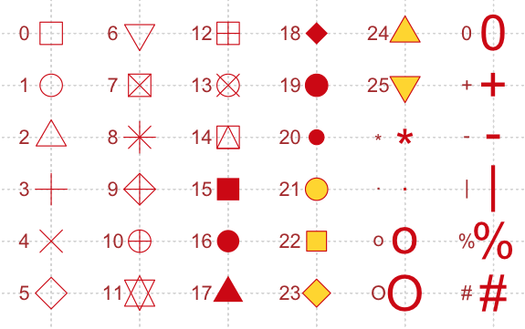

```{r setup, include=FALSE}
knitr::opts_chunk$set(echo = TRUE)
```

## Beeswam
### Install package

```
install.packages('beeswam')
```
### sample code
```{r}
data <- sample(300) #generate sample data
library(beeswarm)
beeswarm(data) # plot beeswarm
```

### specific color
#### show color
```
colors()
```
#### select color
```{r}
beeswarm(data,col="blue")
```
### Sign


```{r}
beeswarm(data,pch=19)
```